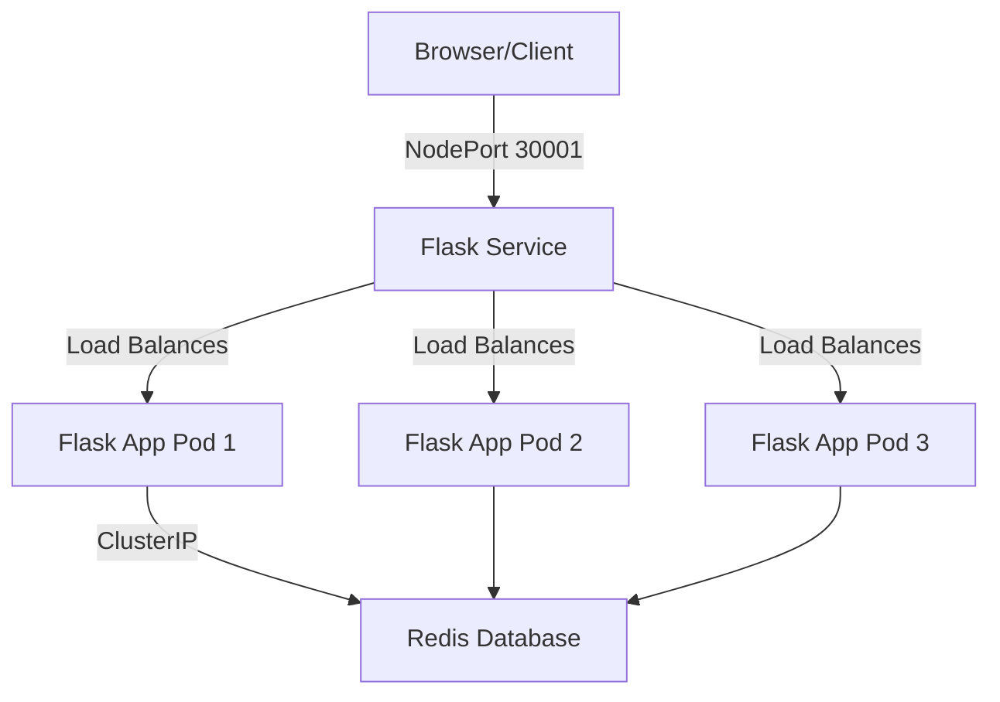

# K8s Task-Master (Blue-Green Deployment Demo)

A simple Task Management API built with **Python Flask** and **Redis**, designed to run on a local **Kubernetes (Minikube)** cluster.

This project demonstrates containerization, Kubernetes orchestration, and deployment strategies.

## 🔵🟢 What is Blue-Green Deployment?

**Blue-Green Deployment** is a release management strategy that reduces downtime and risk by running two identical production environments called "Blue" and "Green".

1.  **Blue (Existing/Live)**: The version currently serving real user traffic.
2.  **Green (New/Staging)**: The new version you want to deploy.

### How it works:
1.  **Deploy**: You deploy the new version to the "Green" environment.
2.  **Test**: Integration and performance tests are run against the Green environment.
3.  **Switch**: Once Green is verified, you switch the router/load balancer to point all traffic to Green.
4.  **Rollback**: If issues arise, you can instantly switch traffic back to Blue.

> **Note on this Implementation**:
> Kubernetes natively handles **Rolling Updates** (gradually replacing pods) which achieves a similar goal of zero-downtime. To achieve strict Blue-Green in K8s, you would typically manage two separate Deployments (e.g., `flask-v1` and `flask-v2`) and update the `Service` selector to switch traffic.
>
> *This repository currently sets up the foundation with a standard Deployment, which can be extended to full Blue-Green workflows.*

## 🏗️ Architecture



## 🚀 Getting Started

### Prerequisites
- **Windows 11** (recommended for the provided script)
- **Docker Desktop** (connected to WSL2)
- **Minikube**
- **Kubectl**

### 🛠️ Installation & Deployment

1.  **Clone the Repository**
    ```bash
    git clone https://github.com/gacheruh/blue-green-deployment-kubernetes.git
    cd blue-green-deployment-kubernetes
    ```

2.  **Run the Deployment Script**
    This PowerShell script automates the entire process: builds the Docker image inside Minikube and applies K8s manifests.
    ```powershell
    .\deploy.ps1
    ```

3.  **Access the Application**
    The script will automatically run `minikube service` to open the URL.
    - **API Base URL**: `http://<MINIKUBE-IP>:<PORT>` (usually exposed via NodePort)

## 📡 API Endpoints

| Method | Endpoint | Description |
| :--- | :--- | :--- |
| `GET` | `/` | Health check & Welcome message |
| `GET` | `/tasks` | Retrieve all tasks from Redis |
| `POST` | `/tasks` | Add a new task (JSON body: `{"task": "..."}`) |

### Usage Examples

**Add a Task:**
```bash
curl -X POST -H "Content-Type: application/json" -d '{"task": "Master Kubernetes"}' http://localhost:30001/tasks
```

**Get Tasks:**
```bash
curl http://localhost:30001/tasks
```

## 🤝 Contributing
1. Fork the repo
2. Create your feature branch (`git checkout -b feature/AmazingFeature`)
3. Commit your changes (`git commit -m 'Add some AmazingFeature'`)
4. Push to the branch (`git push origin feature/AmazingFeature`)
5. Open a Pull Request
